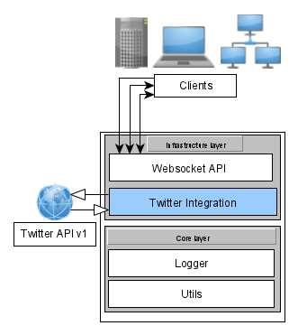

## InTweets

> A simple application to fetch in real-time tweets from Twitter API v1

## Demo
With 2 connected clients to fetch tweets about cats and dogs.


## Install
    go get github.com/LinMAD/InTweets
    go mod download

## Usage

Before executing the application you need to register your own Twitter application: https://developer.twitter.com/en

To work with Twitter API v1 it's required to set `environment variables` for authentication.
```text
TWITTER_CONSUMER_KEY
TWITTER_CONSUMER_SECRET
TWITTER_ACCESS_TOKEN
TWITTER_ACCESS_TOKEN_SECRET
```

When everything ready execute the application and connect via WebSocket and send an interesting track to Twitter,
after you will get tweets in a stream.

WebSocket request body example:
```json
{
  "data": "cat"
}
```

It's possible to configure a host and port where WebSocket will be located.

#### Docker container
There is `Dockerfile` and `docker-compose` deal with dependencies and compilation, recommended only for development.

```text
cmd:$ docker-compose up
```

#### Local execution
```text
cmd:$ ./InTweets --help

Usage of ./InTweets: 
-debug_mode
    Debug mode enabled
-http_host string
    Application host (default "localhost")
-http_port string
    Application port (default "8080")

cmd:$ ./InTweets
time="2020-12-12T18:15:10+01:00" level=info msg="HTTP server initialized..."
time="2020-12-12T18:15:10+01:00" level=info msg="HTTP Server started on http://localhost:8080"
...
```

## Abstract project structure



#### What could be improved
- Reading configuration file as an alternative for env variables.
- Covering project with tests
- Add project to Github CI


